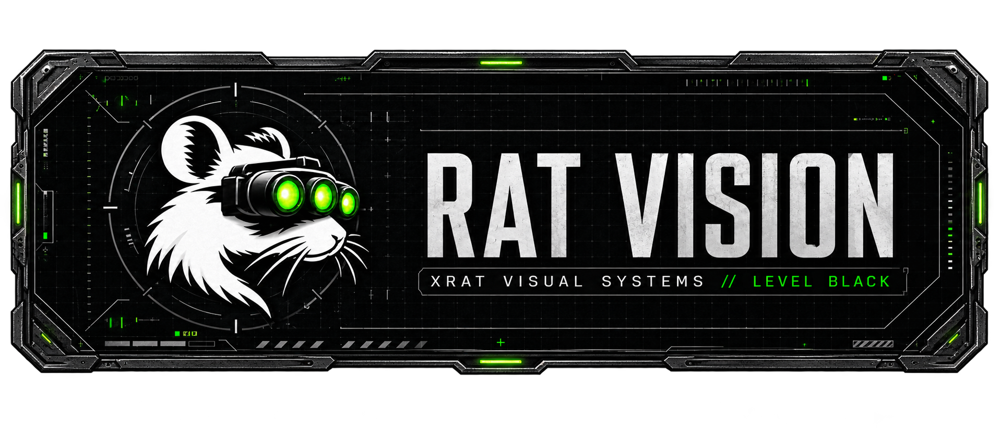
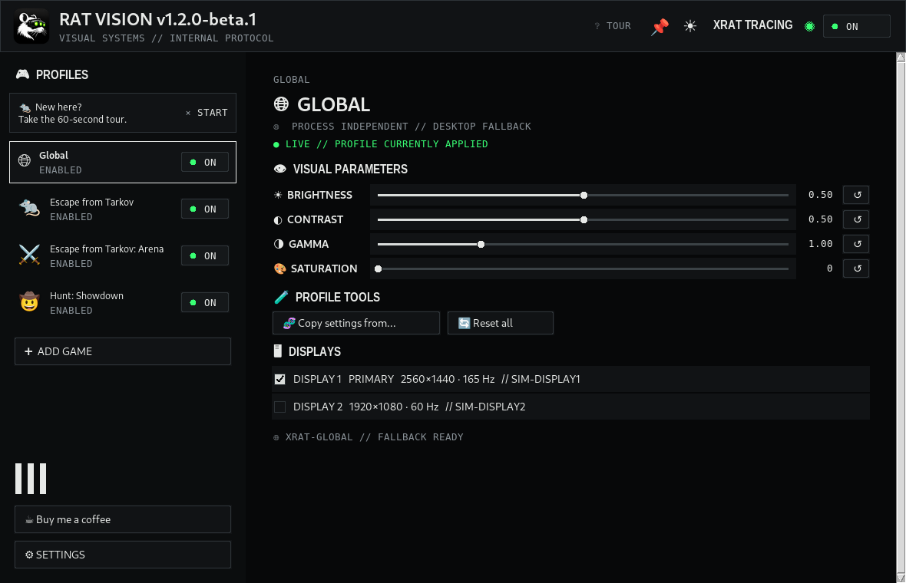
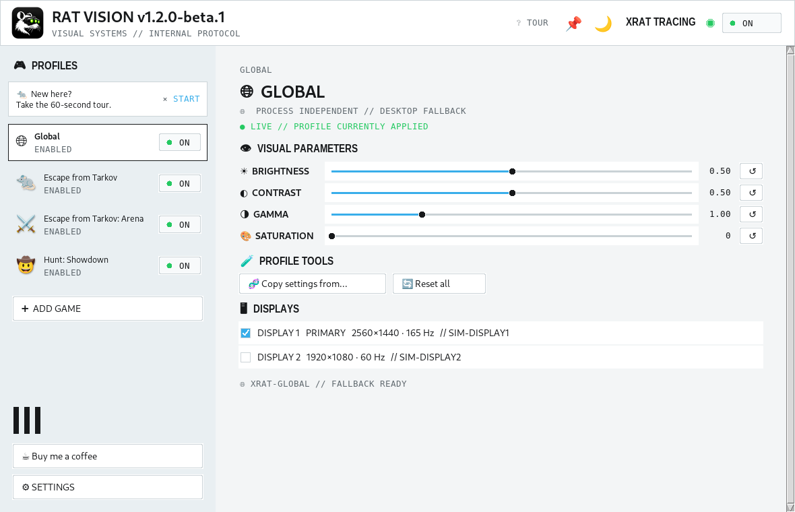
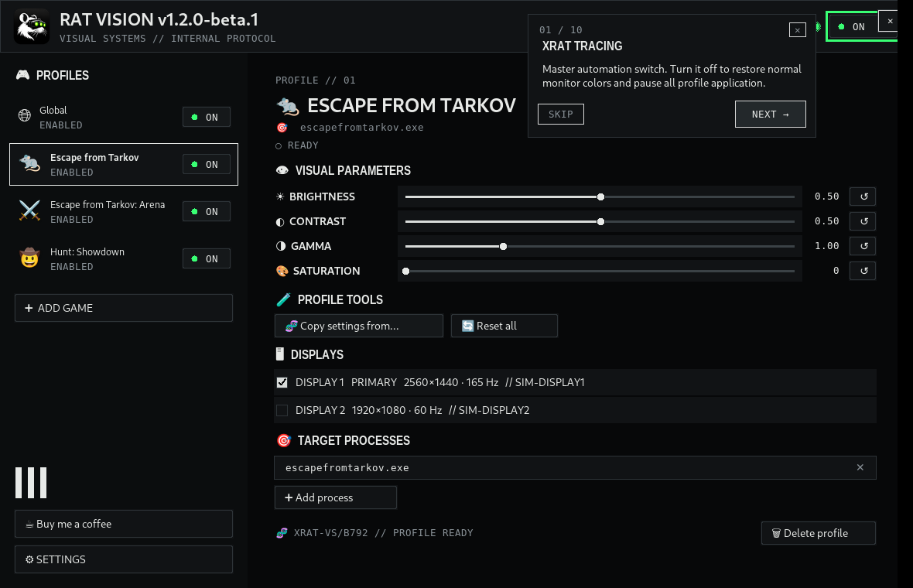
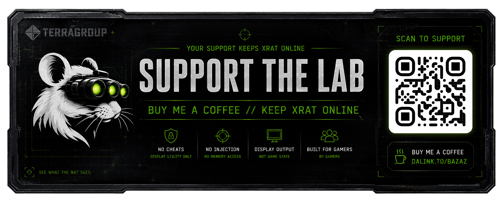

# 🐀 RAT VISION

> 👁️ **See what the rat sees.**<br>
> 🎮 Automatic per-game **display color profiles for Windows** — gamma, brightness, contrast and NVIDIA Digital Vibrance.

RAT VISION automatically applies the display colors you want when a configured game or application becomes active, then restores your desktop profile after Alt-Tab or exit.

> 🧪 **Public beta — Windows/NVIDIA hardware feedback welcome.**

[](#-download)
[](#-roadmap)
[](LICENSE)
[](https://github.com/atikhobaev/rat-vision/actions/workflows/ci.yml)

## 🚀 Download

> **XRAT DISTRIBUTION NODE // PUBLIC BETA**<br>
> `WINDOWS 10/11` · `VERSION 1.2.0-beta.1` · `SHA-256 VERIFIED`

### 🪟 Windows Installer — recommended

## **[⬇️ DOWNLOAD WINDOWS INSTALLER](https://github.com/atikhobaev/rat-vision/releases/download/v1.2.0-beta.1/RAT-VISION-Setup-v1.2.0-beta.1.exe)**

Creates Start Menu and uninstall entries and gives the updater a stable installation path.

### 📦 Portable

## **[⬇️ DOWNLOAD PORTABLE ZIP](https://github.com/atikhobaev/rat-vision/releases/download/v1.2.0-beta.1/RAT-VISION-Portable-v1.2.0-beta.1.zip)**

Unzip anywhere and run `RAT VISION.exe` — no installation required.

> 🛡️ **Display utility only — no injection, no memory access, no game modification.**

## 🖥️ RAT VISION in action



## ✨ Features

> **VISUAL SYSTEMS // CAPABILITY INDEX**<br>
> `FOREGROUND DETECTION` · `PROFILE AUTOMATION` · `MULTI-MONITOR CONTROL`

- 🐀 Per-game/app profiles with instant ON/OFF toggles
- 🌐 Global fallback profile for the desktop and unconfigured apps
- ☀️ Brightness, ◐ Contrast, 🌗 Gamma, 🎨 NVIDIA Digital Vibrance
- 🖥️ Multi-monitor targeting and Windows friendly monitor names
- 🎯 Multiple executable triggers per profile
- 🧪 Copy visual settings between profiles
- 📌 Always-on-top window option
- 🌙 Level Black + ☀️ Clean Lab themes
- ❔ Guided tutorial tour + contextual tooltips
- 🐀 Tray mode with fast global XRAT toggle
- 🔄 GitHub release updater
- 📊 Pseudonymous usage analytics — **enabled by default in configured builds and easy to turn off**

## 🎯 Typical usage

Dark shooters often need a different gamma or color setup than the desktop. RAT VISION enables a brighter or differently corrected profile when the game becomes active, then restores your Global/desktop profile when you Alt-Tab or exit.

It also works as general per-application color correction for games, creative tools, video players and other Windows apps.

## 🧪 How it works

1. 👁️ Observe foreground-window changes through Win32.
2. 🎯 Match the executable name to an enabled profile.
3. 🖥️ Apply Windows gamma ramp to selected displays.
4. 🎨 Apply NVIDIA Digital Vibrance through NVAPI when available.
5. 🌐 Return to Global or normal colors when the application loses focus.

## 🛡️ NOT A CHEAT

> **XRAT LABS // SECURITY CLASSIFICATION: DISPLAY UTILITY**<br>
> `PROCESS OBSERVATION` · `DISPLAY OUTPUT CONTROL` · `NO GAME INJECTION`

**RAT VISION changes what your monitor displays — not what the game renders.**

RAT VISION is a display-output utility. It detects which configured application is in the foreground and applies your chosen monitor color profile. It **does not inject code**, does not read or write **game memory**, does not modify game files, does not automate mouse/keyboard input, and does not interact with anti-cheat systems.

| ✅ RAT VISION does | ❌ RAT VISION does not |
|---|---|
| 🖥️ Change Windows gamma ramp | Inject DLLs/code |
| 🎨 Change NVIDIA Digital Vibrance | Read/write game memory |
| 👁️ Observe the foreground executable name | Modify game files |
| 🎮 Select a profile for that app | Automate input |
| 🌗 Restore desktop colors after Alt-Tab | Interact with anti-cheat |

## 📦 Installer vs Portable

| | 🪟 Installer | 📦 Portable |
|---|---:|---:|
| Admin required | No | No |
| Start Menu entry | ✅ | — |
| Uninstaller | ✅ | — |
| Easy updater path | ✅ | ✅ |
| Move folder freely | — | ✅ |
| Profiles/settings | `%APPDATA%\RAT VISION` | `%APPDATA%\RAT VISION` |

## 🎮 Per-game profiles

Create a profile, select one or more `.exe` files, choose monitors, then set the visual parameters. When a configured executable receives focus, RAT VISION applies that profile.

## 🌐 Global Profile

The Global Profile is process-independent. It is used when no enabled application-specific profile matches. Its ON/OFF switch disables only the Global fallback; the top-level **XRAT TRACING** switch disables all automatic color management.

## 🖥️ Multi-monitor

Profiles can target one or more monitors independently. RAT VISION prefers Windows DisplayConfig/EDID friendly names and keeps the technical `\\.\DISPLAYx` identifier for diagnostics.

## 🔄 Updates

RAT VISION checks public GitHub Releases. Updates are never installed silently: the app discovers a newer eligible release, downloads the matching Installer/Portable asset, verifies SHA-256, then asks you to apply it.

See [`docs/UPDATE_PROTOCOL.md`](docs/UPDATE_PROTOCOL.md).

## 📊 Pseudonymous usage analytics

> **TELEMETRY PROTOCOL // USER CONTROLLED**<br>
> `PSEUDONYMOUS` · `MINIMAL EVENTS` · `SETTINGS OPT-OUT`

📊 Pseudonymous usage analytics are **enabled by default in configured builds** and can be disabled at any time in Settings. RAT VISION uses TelemetryDeck to measure retention and version adoption. Unconfigured builds send no analytics.

The random installation UUID is SHA-256 hashed locally before transmission. No executable names, game/profile names, file paths, usernames, serial numbers or foreground history are collected. See [`docs/ANALYTICS.md`](docs/ANALYTICS.md).

GitHub itself provides Release Asset download counts plus recent repository traffic/referrers.

## 🛡️ Security & VirusTotal

Every public release publishes [`SHA256SUMS.txt`](https://github.com/atikhobaev/rat-vision/releases/download/v1.2.0-beta.1/SHA256SUMS.txt). The Installer EXE, Portable `RAT VISION.exe` and Portable ZIP must each be scanned separately with VirusTotal. **Never copy VirusTotal links from another build.** Real URLs will be added only after scanning the exact published artifacts.

See [`SECURITY.md`](SECURITY.md) for responsible disclosure guidance.

## 📸 More interface views

> **OBSERVATION ARCHIVE // INTERFACE CAPTURES**<br>
> `CLEAN LAB` · `GUIDED PROTOCOL`

### ☀️ Clean Lab



### ❔ Guided tour



## ⚙️ Installation

### Installer

Run `RAT-VISION-Setup-vX.Y.Z.exe`. The default per-user location is `%LOCALAPPDATA%\Programs\RAT VISION`.

### Portable

Extract `RAT-VISION-Portable-vX.Y.Z.zip` and run `RAT VISION.exe`.

## 🧰 Beta verification checklist

For hardware feedback, verify these concrete scenarios: **Global OFF restore**, **Alt-Tab restore/reapply**, **two-monitor independent restore**, **NVIDIA saturation**, **tray OFF/ON lamp**, and **exit restore**. Include diagnostics plus Windows/GPU/monitor details in bug reports.

### ⚡ Everyday UX details

- **Quick ON/OFF** toggles are available directly beside each profile.
- Contextual **tooltips** explain controls and the Global profile behavior.
- The built-in **Tutorial Tour** provides guided onboarding with draggable help cards.
- 📌 **Always on top** is available in the header beside Day/Night.
- Display rows show the **system-reported monitor name** plus technical `DISPLAYx` identity when available.
- The remaining **working Settings toggles** are Launch with Windows, **Start minimized to tray**, and **Closing the window minimizes to tray**.

## 🧑‍💻 Build from source

On Windows run:

```bat
scripts\build-windows.bat
```

The one-click builder downloads a private CPython 3.13 x64 runtime with Tcl/Tk, installs build dependencies, runs tests, and creates `dist\RAT VISION\RAT VISION.exe`.

For a complete release build with Inno Setup installed:

```powershell
.\release\build-release.ps1 -Version 1.2.0-beta.1
```

### 🧪 Simulation / development workflow

`RAT VISION v1.2.0-beta.1` can be launched without touching real display hardware:

```bash
python -m ratvision --simulate
```

The Windows one-click build is self-contained: **system Python is not required**. `scripts\build-windows.bat` installs a private CPython 3.13 x64 runtime with Tcl/Tk into the project build directory.

### 🎯 Built-in starter profiles

The first run includes starter profiles for **Escape from Tarkov**, **Escape from Tarkov: Arena**, and **Hunt: Showdown**. They are ordinary editable profile presets, not game modifications.

The one-click Windows builder **downloads the official CPython 3.13.15 x64 installer** from python.org, verifies its SHA-256, and installs it privately for the build.

The private runtime is installed with **Tcl/Tk enabled** so the Tkinter UI builds and runs consistently.

## 🗺️ Roadmap

- 🧪 Broaden Windows/NVIDIA hardware testing during public beta
- 🖥️ Improve display/GPU compatibility diagnostics
- 🔄 Harden self-update based on real published releases
- 📊 Improve pseudonymous retention metrics while keeping telemetry transparent and easy to disable

## ☕ Support

[](https://dalink.to/bazaz)

If RAT VISION saves you time tweaking gamma every time you launch a shooter, click the panel above or use the in-app **☕ Buy me a coffee** button. Your support keeps XRAT development, hardware testing and public releases moving.

## 📜 Licenses

See [`LICENSES.md`](LICENSES.md) for third-party and reused-code license notices.
